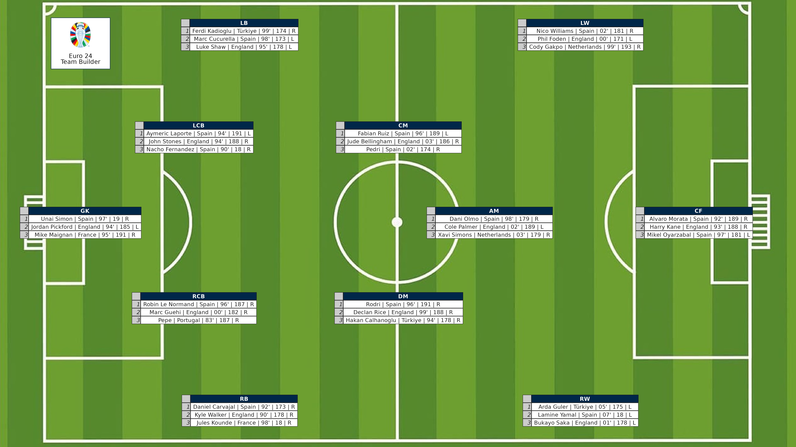

# 2024 Posit Shiny Contest: Euro 2024 Team Builder

### Purpose:
Team Builder is an innovative Shiny application designed to allow users to create their own ideal squad from the players participating in Euro 2024. This application enables football enthusiasts to select and rank their favorite players by position, ultimately building their personalized team. It also provides a visual representation of how the selected players would be positioned on the field, based on their roles.

### Full Description:
Team Builder offers a user-friendly interface that provides access to the data of all players participating in Euro 2024. Users can select players for each position, with a maximum of three players per position, and then rank these players to form their ideal squad. Once the ranking is complete, the application displays the players on a field, generated using ggplot, showing their positions and ranks visually. This graphic can be downloaded as a PNG file, allowing users to save and share their custom-built teams. By transforming the excitement of Euro 2024 into an interactive experience, Team Builder enables football fans to engage with the tournament in a deeper and more personalized way.

### Screenshots

